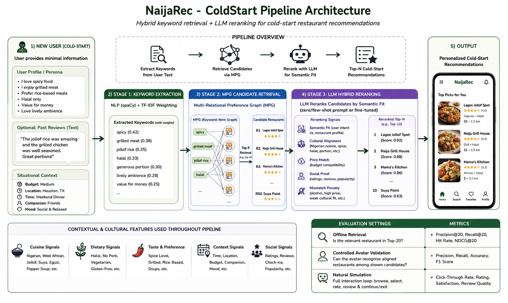
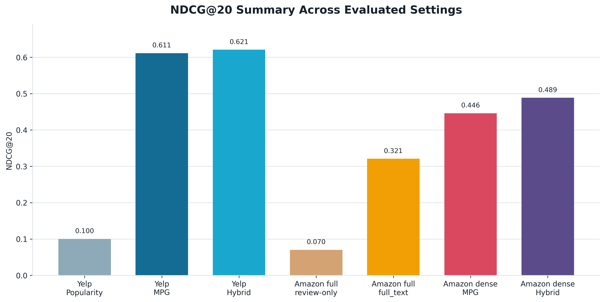
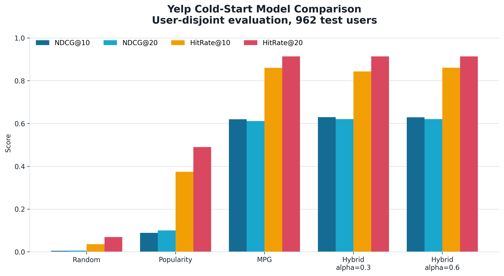
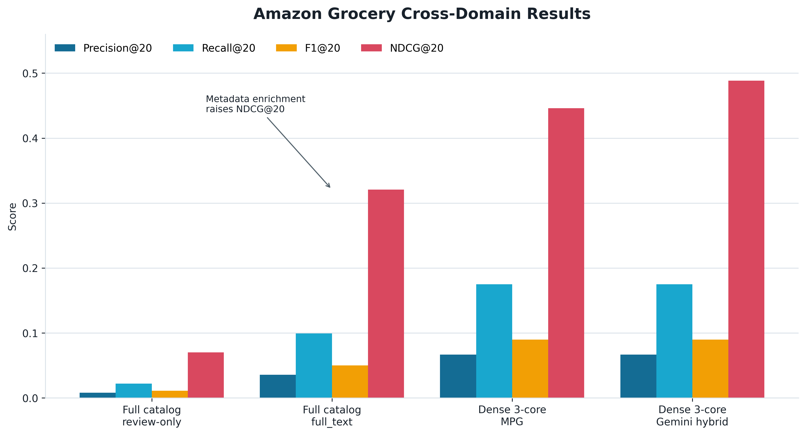
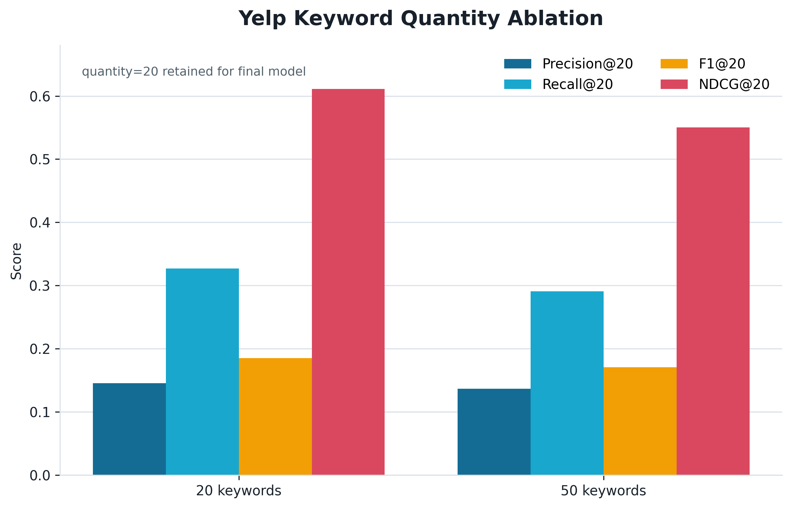
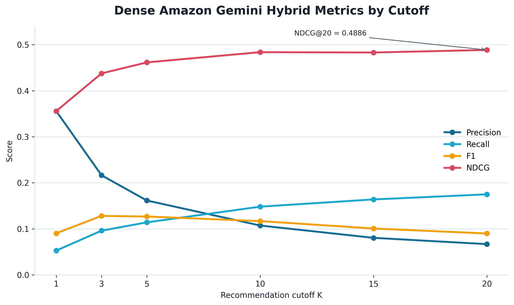

# NaijaRec - Cold Start

**NaijaRec Cold Start** is an offline recommendation research pipeline for evaluating text-driven cold-start recommendation in a Nigerian diaspora restaurant context. The main experiment uses Yelp restaurant reviews from Philadelphia, Tampa, and Nashville as a diaspora-proxy dataset, while Amazon Grocery is used as a cross-domain stress test to evaluate whether the same retrieval and reranking pipeline transfers to a different item domain.

This repository focuses on the reproducibility of the offline experiments: dataset preparation, keyword extraction, review-derived graph retrieval, LLM-based reranking, hybrid reranking, and metric evaluation.

The containerized persona recommendation application is documented separately in [`app/README.md`](app/README.md).

---

## Table of Contents

- [Project Summary](#project-summary)
- [What Is Implemented](#what-is-implemented)
- [System Design](#system-design)
- [Repository Structure](#repository-structure)
- [Environment Setup](#environment-setup)
- [Dataset and Artifact Access](#dataset-and-artifact-access)
- [Quick Reproduction Paths](#quick-reproduction-paths)
- [Yelp Restaurant Experiments](#yelp-restaurant-experiments)
- [Amazon Grocery Cross-Domain Experiments](#amazon-grocery-cross-domain-experiments)
- [Main Results](#main-results)
- [Result Visualizations](#result-visualizations)
- [Metric Interpretation](#metric-interpretation)
- [Limitations](#limitations)
- [Security and Submission Checklist](#security-and-submission-checklist)
- [Additional Documentation](#additional-documentation)
- [References](#references)

---

## Project Summary

The project studies cold-start recommendation using review-derived textual evidence. Instead of relying only on historical user-item interactions, the system builds a heterogeneous keyword graph from reviews and item metadata, retrieves candidate items through keyword evidence, and optionally reranks the retrieved candidates using Gemini or a stored hybrid reranking method.

The primary domain is a Nigerian-contextualized restaurant recommendation task built from Yelp restaurants in:

```text
Philadelphia, Tampa, Nashville
```

The term `naija_yelp` names the contextualized recommendation task. It does **not** mean the restaurants are physically located in Nigeria.

Amazon Grocery is used as a cross-domain experiment. In this setting, the same text-driven retrieval and reranking pipeline is evaluated on grocery products instead of restaurants.

---

## What Is Implemented

This repository implements and reports the following methods:

```text
Random baseline
Popularity baseline
MPG retrieval
Gemini reranking
MPG + hybrid reranking
```

The main retrieval method is **MPG**, adapted from the Kalm4Rec-style review-derived graph approach. MPG uses keyword evidence extracted from user reviews and item profiles to support cold-start recommendation.

LightGCN is discussed as a relevant collaborative-filtering baseline, but it was **not executed** in the reported experiments. Therefore, this repository does not claim LightGCN results.

### Important Implementation Boundary

The Nigerian contextualization is represented through metadata, review text, keyword evidence, and semantic item profiles. The system uses signals such as:

```text
spice or pepper cues
jollof or rice dishes
suya or grilled meat
halal suitability
portion and value cues
family dining
service warmth
West African similarity
```

These signals should be understood as text-derived proxy features. They are not separate learned cultural embeddings, and the dataset should not be interpreted as a direct benchmark of Nigerian restaurant-market behavior.

---

## System Design




The offline research pipeline follows this sequence:

```text
Raw review and metadata files
        ↓
Dataset preparation and split generation
        ↓
Keyword extraction and embedding generation
        ↓
Review-derived heterogeneous graph construction
        ↓
MPG candidate retrieval
        ↓
Gemini or hybrid reranking
        ↓
Metric evaluation
```

### Review-Derived Knowledge Graph

The recommendation pipeline uses a review-derived heterogeneous graph adapted from the Kalm4Rec method:

```text
user → keyword → item
```

For Yelp, an item is a restaurant. For Amazon Grocery, an item is a grocery product.

Item-keyword relationships are weighted using TF-IUF. Test-user keywords are aligned with training keywords using sentence embeddings and nearest-neighbor matching. This allows the recommender to use text-derived preference evidence for users who do not have an identity in the training graph.

### Why MPG Is the Main Method

MPG is the main retrieval method because the research problem focuses on cold-start recommendation, contextual reasoning, and text-derived user preference evidence.

LightGCN is an interaction-only collaborative-filtering method based on a user-item graph. It is relevant as a future baseline, but it does not directly use review text, product titles, cultural signals, or semantic item profiles unless additional feature modeling is added.

---

## Repository Structure

```text
app/                            Containerized application; see app/README.md

taskB/
  prepare_naija_yelp.py         Yelp/Naija data adapter and split protocol
  prepare_amazon_reviews.py     Amazon adapter, full_text builder, and k-core filtering
  evaluate_baselines.py         Random and Popularity baseline evaluation
  hybrid_rerank.py              Stored MPG + LLM hybrid reranking evaluator

extractor.py                    Keyword extraction and embedding generation
retrieval.py                    MPG candidate retrieval and evaluation
reRanker/rerank.py              Gemini reranking and metric evaluation

data/metadata/                  Item semantic profiles used by experiments
data/reviews/                   Prepared datasets and split files
data/out2LLMs/                  MPG candidate files used for reranking

docs/chapter_3_4_readme.md      Detailed methodology and results notes
docs/task_b_naijarec_cold_start.md  Task B adaptation notes
requirements.txt                Experimental Python dependencies
```

---

## Environment Setup

### Recommended Software

| Tool   | Version                         |
| ------ | ------------------------------- |
| Python | Python 3.10 or 3.11 recommended |
| OS     | Linux tested                    |

The original experimental environment used Python 3.9, but Google library end-of-life warnings appeared during Gemini runs. Python 3.10 or 3.11 is recommended for a cleaner setup unless exact environment replication is required.

### Installation

```bash
git clone <YOUR_GITHUB_REPOSITORY_URL>
cd naijarec_cold-start

python -m venv .venv
source .venv/bin/activate

python -m pip install --upgrade pip
pip install -r requirements.txt
python -m spacy download en_core_web_sm
```

The extractor attempts to download required NLTK resources automatically:

```text
punkt
stopwords
averaged_perceptron_tagger
```

If the environment blocks downloads, install them manually:

```bash
python - <<'PY'
import nltk
nltk.download("punkt")
nltk.download("stopwords")
nltk.download("averaged_perceptron_tagger")
PY
```

### Gemini Configuration

Gemini is required only for live LLM reranking. It is not required for dataset preparation, keyword extraction, MPG retrieval, Random/Popularity baselines, or stored hybrid evaluation.

Set the key as an environment variable:

```bash
export GOOGLE_API_KEY="YOUR_GEMINI_API_KEY"
```

Do not commit API keys, `.env` files, terminal logs containing secrets, or result files containing secrets.

---

## Dataset and Artifact Access

The experimental data directory is excluded from GitHub because the prepared datasets and intermediate artifacts are large.

Before submission, upload the required files to Google Drive, set access to **Anyone with the link: Viewer**, and replace every placeholder below with a working public link.

### Required Files for Full Reproduction

| File or archive path                                                 | Purpose                                                                          | Approx. local size | Google Drive link                                   |
| -------------------------------------------------------------------- | -------------------------------------------------------------------------------- | -----------------: | --------------------------------------------------- |
| `user_review_history.json`                                           | Raw Yelp user-review export from notebook                                        |              98 MB | `<ADD_GOOGLE_DRIVE_LINK_USER_HISTORY>`              |
| `restaurant_detail.csv`                                              | Raw Yelp restaurant metadata                                                     |             1.3 MB | `<ADD_GOOGLE_DRIVE_LINK_RESTAURANT_DETAIL>`         |
| `data/raw/amazonGrocery_enriched_raw.csv`                            | Raw Amazon rows with `full_text`, title, and metadata                            | upload source file | `<ADD_GOOGLE_DRIVE_LINK_AMAZON_ENRICHED_RAW>`       |
| `data/metadata/naija_yelp_paper_restaurant_detail.csv`               | Prepared Yelp semantic profiles; optional rebuild shortcut                       |             3.5 MB | `<ADD_GOOGLE_DRIVE_LINK_NAIJA_METADATA>`            |
| `data/metadata/amazonGrocery_restaurant_detail.csv`                  | Prepared full Amazon semantic profiles; optional rebuild shortcut                |              80 MB | `<ADD_GOOGLE_DRIVE_LINK_AMAZON_FULL_METADATA>`      |
| `data/metadata/amazonGrocery_dense_restaurant_detail.csv`            | Prepared dense Amazon semantic profiles; optional rebuild shortcut               |             7.3 MB | `<ADD_GOOGLE_DRIVE_LINK_AMAZON_DENSE_METADATA>`     |
| `data/reviews/naija_yelp_paper.csv` + splits + metadata              | Prepared Yelp protocol files; optional shortcut                                  |        about 86 MB | `<ADD_GOOGLE_DRIVE_LINK_PREPARED_YELP_ZIP>`         |
| `data/reviews/amazonGrocery.csv` + splits + metadata                 | Prepared full Amazon protocol files; optional shortcut                           |       about 133 MB | `<ADD_GOOGLE_DRIVE_LINK_PREPARED_AMAZON_FULL_ZIP>`  |
| `data/reviews/amazonGrocery_dense.csv` + splits + metadata           | Prepared 3-core Amazon protocol files; optional shortcut                         |        about 17 MB | `<ADD_GOOGLE_DRIVE_LINK_PREPARED_AMAZON_DENSE_ZIP>` |
| `data/keywords/`, `data/score/`, `data/embedding/`, `data/out2LLMs/` | Optional precomputed artifacts to skip long extraction/retrieval stages          |              large | `<ADD_GOOGLE_DRIVE_LINK_PRECOMPUTED_ARTIFACTS_ZIP>` |
| `reRanker/results_rerank/naija_yelp_paper/zeroshot_3_5_12.json`      | Stored LLM ranking needed to exactly reproduce the no-new-API Yelp hybrid result |             120 KB | `<ADD_GOOGLE_DRIVE_LINK_YELP_LLM_RANKING>`          |

### Download Example

After replacing placeholders with real public links, prepared semantic profiles can be downloaded with `gdown`:

```bash
mkdir -p data/metadata data/raw

python -m gdown --fuzzy "<ADD_GOOGLE_DRIVE_LINK_NAIJA_METADATA>" \
  -O data/metadata/naija_yelp_paper_restaurant_detail.csv

python -m gdown --fuzzy "<ADD_GOOGLE_DRIVE_LINK_AMAZON_FULL_METADATA>" \
  -O data/metadata/amazonGrocery_restaurant_detail.csv

python -m gdown --fuzzy "<ADD_GOOGLE_DRIVE_LINK_AMAZON_DENSE_METADATA>" \
  -O data/metadata/amazonGrocery_dense_restaurant_detail.csv

python -m gdown --fuzzy "<ADD_GOOGLE_DRIVE_LINK_AMAZON_ENRICHED_RAW>" \
  -O data/raw/amazonGrocery_enriched_raw.csv
```

For a prepared or precomputed ZIP bundle, download it with `gdown` and unzip it from the repository root so it restores the expected `data/...` paths.

---

## Quick Reproduction Paths

There are two ways to reproduce the experiments.

### Path 1: Fast Reproduction With Prepared Artifacts

Use this path when the prepared datasets, metadata files, embeddings, retrieval outputs, and stored reranking files are available.

Recommended for:

```text
reviewers
judges
quick verification
no-new-API reproduction
```

This path avoids rebuilding large intermediate files and avoids live Gemini calls when stored reranking artifacts are used.

### Path 2: Full Rebuild From Raw Files

Use this path when validating the full pipeline from raw review exports and metadata files.

Recommended for:

```text
full audit
research verification
method extension
ablation studies
```

This path is slower because it rebuilds prepared datasets, keyword files, embeddings, retrieval outputs, and reranking inputs.

---

## Yelp Restaurant Experiments

### A. Build the Yelp Restaurant Datasets

Place these files in the repository root:

```text
user_review_history.json
restaurant_detail.csv
```

Then run:

```bash
python taskB/prepare_naija_yelp.py \
  --user_history user_review_history.json \
  --restaurant_detail restaurant_detail.csv \
  --dataset_name naija_yelp \
  --target_cities Philadelphia Tampa Nashville \
  --holdout_per_user 1 \
  --cold_start \
  --paper_protocol_dataset naija_yelp_paper
```

Expected paper-protocol dataset summary:

```text
Users: 9,614
Reviews: 101,708
Restaurants/items: 2,608
Train/dev/test users: 7,691 / 961 / 962
```

This command writes:

```text
data/reviews/naija_yelp.csv
data/reviews/naija_yelp_holdout.csv
data/reviews/naija_yelp_splits.json
data/reviews/naija_yelp_cold_start.csv
data/reviews/naija_yelp_cold_start_splits.json
data/reviews/naija_yelp_paper.csv
data/reviews/naija_yelp_paper_splits.json
data/metadata/naija_yelp_restaurant_detail.csv
data/metadata/naija_yelp_paper_restaurant_detail.csv
```

### B. Temporal Next-Item Baseline

The temporal setup evaluates one held-out later restaurant per user. It is deliberately harder than the Kalm4Rec-style user-disjoint setup.

```bash
python taskB/evaluate_baselines.py \
  --history data/reviews/naija_yelp.csv \
  --holdout data/reviews/naija_yelp_holdout.csv \
  --k 20
```

Run temporal MPG retrieval:

```bash
python extractor.py --city naija_yelp --edgeType IUF --kwExtractor kw_NLTK --overwrite

python retrieval.py \
  --city naija_yelp \
  --edgeType IUF \
  --quantity 20 \
  --validTopK 20 \
  --export2LLMs \
  --groundtruth_file data/reviews/naija_yelp_holdout.csv
```

Reported temporal MPG result:

| Method             | Precision@20 | Recall@20 |    F1@20 |  NDCG@20 |
| ------------------ | -----------: | --------: | -------: | -------: |
| MPG, `quantity=20` |     0.004782 |  0.095634 | 0.009108 | 0.030987 |

### C. Yelp Cold-Start User-Disjoint Experiment

#### C1. Extract Keywords

```bash
python extractor.py \
  --city naija_yelp_paper \
  --edgeType IUF \
  --kwExtractor kw_NLTK \
  --overwrite
```

#### C2. Run MPG Retrieval

```bash
python retrieval.py \
  --city naija_yelp_paper \
  --edgeType IUF \
  --quantity 20 \
  --validTopK 20 \
  --export2LLMs
```

This produces quantity-tagged reranking inputs:

```text
data/out2LLMs/naija_yelp_paper_q20_knn2rest.json
data/out2LLMs/naija_yelp_paper_q20_user2candidate.json
```

Reported MPG result:

| Method             | Precision@20 | Recall@20 |    F1@20 |  NDCG@20 |
| ------------------ | -----------: | --------: | -------: | -------: |
| MPG, `quantity=20` |     0.145166 |  0.326992 | 0.184961 | 0.611271 |

#### C3. Run Random and Popularity Baselines

Popularity is calculated using train users only. Test-user interactions are not used to compute item popularity.

```bash
python taskB/evaluate_baselines.py \
  --history data/reviews/naija_yelp_paper.csv \
  --holdout data/reviews/naija_yelp_paper.csv \
  --k 10 \
  --splits data/reviews/naija_yelp_paper_splits.json \
  --dataset_name naija_yelp_paper \
  --split test \
  --history_split train

python taskB/evaluate_baselines.py \
  --history data/reviews/naija_yelp_paper.csv \
  --holdout data/reviews/naija_yelp_paper.csv \
  --k 20 \
  --splits data/reviews/naija_yelp_paper_splits.json \
  --dataset_name naija_yelp_paper \
  --split test \
  --history_split train
```

Reported baseline results:

| Method     |  NDCG@10 | HitRate@10 |  NDCG@20 | HitRate@20 |
| ---------- | -------: | ---------: | -------: | ---------: |
| Random     | 0.004646 |   0.035343 | 0.005746 |   0.068607 |
| Popularity | 0.088333 |   0.374220 | 0.100273 |   0.489605 |

#### C4. Run Live Gemini Reranking

This stage requires a Gemini API key. Results may vary slightly because API models, safety behavior, and quota conditions can change over time.

```bash
export GOOGLE_API_KEY="YOUR_GEMINI_API_KEY"

python reRanker/rerank.py \
  --city naija_yelp_paper \
  --api_key "$GOOGLE_API_KEY" \
  --groundtruth_file data/reviews/naija_yelp_paper.csv \
  --metadata_file data/metadata/naija_yelp_paper_restaurant_detail.csv \
  --rerank_mode listwise \
  --candidate_pool_k 20 \
  --rerank_top_k 20 \
  --request_delay 4.5 \
  --max_users 962
```

Previously recorded Gemini listwise result:

| Method          |      P@1 | Recall@10 |  NDCG@10 | Recall@20 |  NDCG@20 |
| --------------- | -------: | --------: | -------: | --------: | -------: |
| Gemini reranker | 0.480249 |  0.224172 | 0.617021 |  0.326992 | 0.607893 |

#### C5. Reproduce Stored Hybrid Results Without New API Calls

The following commands use the saved LLM ranking file and restored `quantity=20` MPG candidates:

```bash
python taskB/hybrid_rerank.py --city naija_yelp_paper --alpha 0.3
python taskB/hybrid_rerank.py --city naija_yelp_paper --alpha 0.6
```

Reported comparison:

| Method              | Precision@10 |    Recall@10 |      NDCG@10 |   HitRate@10 |      NDCG@20 | HitRate@20 |
| ------------------- | -----------: | -----------: | -----------: | -----------: | -----------: | ---------: |
| MPG                 |     0.208524 |     0.241273 |     0.619777 |     0.859667 |     0.611271 |   0.913721 |
| Hybrid, `alpha=0.3` |     0.197505 |     0.233253 | **0.629689** |     0.843035 | **0.620736** |   0.913721 |
| Hybrid, `alpha=0.6` |     0.207380 | **0.242829** |     0.628581 | **0.860707** |     0.620657 |   0.913721 |

Interpretation: Hybrid `alpha=0.3` gives the strongest NDCG result, while Hybrid `alpha=0.6` gives the strongest measured Recall@10/HitRate@10 balance. Raw MPG remains stronger than `alpha=0.3` on some top-10 coverage metrics, so the hybrid method is not claimed as universally better.

#### C6. Yelp Keyword Quantity Ablation

```bash
python retrieval.py \
  --city naija_yelp_paper \
  --edgeType IUF \
  --quantity 50 \
  --validTopK 20 \
  --export2LLMs
```

| Quantity | Precision@20 | Recall@20 |    F1@20 |  NDCG@20 |
| -------: | -----------: | --------: | -------: | -------: |
|       20 |     0.145166 |  0.326992 | 0.184961 | 0.611271 |
|       50 |     0.136746 |  0.290734 | 0.170722 | 0.550238 |

For Yelp, adding more keyword features reduced retrieval quality. Therefore, `quantity=20` is used as the selected configuration.

---

## Amazon Grocery Cross-Domain Experiments

The project uses the term **cross-domain**, not cross-chain. It means the same recommendation architecture is evaluated on two item domains.

| Domain           | Items            | Evidence                                                                               |
| ---------------- | ---------------- | -------------------------------------------------------------------------------------- |
| Yelp restaurants | Restaurants      | Reviews, cuisine, spice cues, halal cues, value cues, service cues, family dining cues |
| Amazon Grocery   | Grocery products | Reviews, product titles, categories, descriptions, flavor/product-type cues            |

Cross-domain does not mean Amazon interactions are used to train a restaurant identity model. It means the text-driven retrieval and reranking design can be applied to distinct item domains using the same general pipeline.

Two Amazon protocols are reported:

| Protocol                         | Purpose                                                                                       |
| -------------------------------- | --------------------------------------------------------------------------------------------- |
| Full Amazon Grocery              | Large-catalog sparse stress test over 48,297 products                                         |
| Dense Amazon Grocery true 3-core | Controlled experiment where remaining users and items have stronger interaction/text evidence |

The dense protocol is not a replacement for the full result. Both are reported because they answer different questions.

### A. Full Amazon Grocery Stress Test

#### A1. Prepare Full Amazon With Metadata-Enriched Text

Keep the raw enriched Amazon source outside `data/reviews/amazonGrocery.csv`, because that output path becomes the normalized prepared dataset.

The raw source must include:

```text
user_id, item_id, rating, review_text, title, categories, description, full_text
```

Prepare it:

```bash
mkdir -p data/raw

python taskB/prepare_amazon_reviews.py \
  --reviews data/raw/amazonGrocery_enriched_raw.csv \
  --metadata data/raw/amazonGrocery_enriched_raw.csv \
  --dataset_name amazonGrocery \
  --min_reviews 5
```

Expected prepared summary:

```text
Users: 14,176
Reviews: 114,306
Items: 48,297
Train/dev/test users: 11,340 / 1,417 / 1,419
```

#### A2. Full Amazon MPG Retrieval

```bash
python extractor.py \
  --city amazonGrocery \
  --edgeType IUF \
  --kwExtractor kw_NLTK \
  --overwrite

python retrieval.py \
  --city amazonGrocery \
  --edgeType IUF \
  --quantity 20 \
  --validTopK 20 \
  --export2LLMs
```

Full Amazon results:

| Experiment                                | Precision@20 | Recall@20 |    F1@20 |      NDCG@20 |
| ----------------------------------------- | -----------: | --------: | -------: | -----------: |
| Review text only, exploratory run         |     0.007963 |  0.022153 | 0.011220 |     0.070276 |
| `full_text` with product-title enrichment |     0.035729 |  0.099116 | 0.050132 | **0.320753** |

The metadata-enriched `full_text` representation improved Amazon NDCG@20 from `0.070276` to `0.320753`, showing that cross-domain grocery retrieval benefits from title/category-level semantic evidence.

### B. Dense Amazon Grocery Controlled Experiment

The full Amazon catalog is highly sparse. A stricter item threshold of 5 or 10 collapses the available graph after enforcing a minimum of 5 user interactions. The strongest surviving controlled configuration is a true iterative 3-core item setting:

```text
minimum user interactions: 5
minimum item interactions: 3
maximum pre-filter item pool: 10,000
```

#### B1. Create the 3-Core Dense Dataset

```bash
python taskB/prepare_amazon_reviews.py \
  --reviews data/reviews/amazonGrocery.csv \
  --metadata data/metadata/amazonGrocery_restaurant_detail.csv \
  --dataset_name amazonGrocery_dense \
  --min_reviews 5 \
  --min_item_reviews 3 \
  --max_items 10000
```

Expected summary:

```text
Users: 2,074
Reviews: 17,187
Items: 3,532
Train/dev/test users: 1,659 / 207 / 208
Final minimum user reviews: 5
Final minimum item reviews: 3
```

#### B2. Extract and Retrieve

```bash
python extractor.py \
  --city amazonGrocery_dense \
  --edgeType IUF \
  --kwExtractor kw_NLTK \
  --overwrite

python retrieval.py \
  --city amazonGrocery_dense \
  --edgeType IUF \
  --quantity 20 \
  --validTopK 20 \
  --export2LLMs
```

Reported dense MPG result:

| Method                        | Precision@20 | Recall@20 |    F1@20 |  NDCG@20 |
| ----------------------------- | -----------: | --------: | -------: | -------: |
| Dense Amazon MPG, true 3-core |     0.066827 |  0.174981 | 0.089956 | 0.445954 |

#### B3. Run Dense Amazon Gemini Hybrid Reranking

```bash
export GOOGLE_API_KEY="YOUR_GEMINI_API_KEY"

python reRanker/rerank.py \
  --city amazonGrocery_dense \
  --api_key "$GOOGLE_API_KEY" \
  --metadata_file data/metadata/amazonGrocery_dense_restaurant_detail.csv \
  --rerank_mode scored \
  --candidate_pool_k 50 \
  --rerank_top_k 20 \
  --hybrid_alpha 0.6 \
  --request_delay 4.5 \
  --max_users 208
```

Reported reranked dense Amazon result:

| Method                                  | Precision@10 | Recall@10 |  NDCG@10 | Precision@20 | Recall@20 |    F1@20 |      NDCG@20 |
| --------------------------------------- | -----------: | --------: | -------: | -----------: | --------: | -------: | -----------: |
| Dense Amazon MPG                        |            - |         - |        - |     0.066827 |  0.174981 | 0.089956 |     0.445954 |
| Dense Amazon Gemini hybrid, `alpha=0.6` |     0.107212 |  0.148208 | 0.483787 |     0.066827 |  0.174981 | 0.089956 | **0.488582** |

Because the hybrid run preserves the MPG top-20 candidate set, Precision@20, Recall@20, and F1@20 remain unchanged. The NDCG increase indicates improved ordering within the existing candidate set.

---

## Main Results

### Yelp Restaurant Results

| Method                    | Evaluation setting |      NDCG@10 |      NDCG@20 |   HitRate@10 | HitRate@20 |
| ------------------------- | ------------------ | -----------: | -----------: | -----------: | ---------: |
| Random                    | Paper protocol     |     0.004646 |     0.005746 |     0.035343 |   0.068607 |
| Popularity                | Paper protocol     |     0.088333 |     0.100273 |     0.374220 |   0.489605 |
| MPG                       | Paper protocol     |     0.619777 |     0.611271 |     0.859667 |   0.913721 |
| MPG + hybrid, `alpha=0.3` | Paper protocol     | **0.629689** | **0.620736** |     0.843035 |   0.913721 |
| MPG + hybrid, `alpha=0.6` | Paper protocol     |     0.628581 |     0.620657 | **0.860707** |   0.913721 |

### Amazon Grocery Results

| Method                                   | Dataset protocol         | Precision@20 | Recall@20 |    F1@20 |      NDCG@20 |
| ---------------------------------------- | ------------------------ | -----------: | --------: | -------: | -----------: |
| MPG with raw review-only evidence        | Full Amazon exploratory  |     0.007963 |  0.022153 | 0.011220 |     0.070276 |
| MPG with `full_text` metadata enrichment | Full Amazon stress test  |     0.035729 |  0.099116 | 0.050132 |     0.320753 |
| MPG with `full_text`                     | Dense Amazon true 3-core |     0.066827 |  0.174981 | 0.089956 |     0.445954 |
| Gemini hybrid `alpha=0.6`                | Dense Amazon true 3-core |     0.066827 |  0.174981 | 0.089956 | **0.488582** |

---

## Result Visualizations

All figures are generated from the reported values above. The script writes PNG files for Markdown/report use and vector SVG versions for final document layout:

```bash
MPLCONFIGDIR=/tmp/naijarec_mpl python taskB/plot_results.py --out_dir docs/figures
```

The overall NDCG view summarizes distinct evaluated settings. Yelp and Amazon have different protocols and catalog difficulty, so this graph should be read as a reporting overview, not a same-dataset head-to-head test.



The Yelp comparison establishes performance over Random and Popularity baselines and shows the close trade-off between MPG and hybrid reranking.



The Amazon comparison shows the cross-domain progression from sparse review-only evidence to metadata-enriched and dense-catalog evaluation.



The keyword quantity ablation supports keeping `quantity=20`, while the line plot exposes the behavior of the dense Amazon Gemini hybrid result as `K` increases.





---

## Metric Interpretation

Candidate retrieval is reported with Precision, Recall, F1, and NDCG because this stage determines whether relevant items enter the candidate set.

Reranking is emphasized using NDCG and HitRate because the reranker mainly changes the ordering of already retrieved candidates. When the reranker preserves the same top-20 candidate pool, Precision@20, Recall@20, and F1@20 may remain unchanged while NDCG improves.

---

## Key Intermediate Files

The following files are important for reproducing reranking and hybrid evaluation:

| File                                           | Description                                                                      |
| ---------------------------------------------- | -------------------------------------------------------------------------------- |
| `data/out2LLMs/<city>_q20_user2candidate.json` | Candidate items generated for each user by MPG retrieval                         |
| `data/out2LLMs/<city>_q20_knn2rest.json`       | Keyword-nearest-neighbor retrieval mapping used to produce item candidates       |
| `data/metadata/<city>_restaurant_detail.csv`   | Item profile metadata used during reranking and semantic evaluation              |
| `reRanker/results_rerank/...json`              | Stored LLM ranking output used to reproduce hybrid results without new API calls |

---

## Runtime and Reproducibility Notes

Exact runtime depends on hardware, catalog size, API quota, and whether precomputed artifacts are used.

General expectations:

```text
Yelp preprocessing: moderate
Yelp keyword extraction and retrieval: moderate
Full Amazon preprocessing and retrieval: slower due to catalog size
Gemini reranking: depends on API quota, request delay, and model availability
Stored hybrid evaluation: fast once candidate and LLM ranking files are restored
```

For exact reproduction, prefer stored ranking artifacts. Live Gemini reranking should be treated as a repeat run rather than a bit-for-bit deterministic reproduction, because hosted LLM behavior and API conditions may change.

---

## Limitations

The Nigerian restaurant task is a diaspora-proxy evaluation, not a direct Nigerian restaurant-market benchmark. The selected Yelp cities provide English-language restaurant reviews and metadata that allow testing culturally relevant food cues, but they do not fully represent Nigerian diners, Nigerian restaurants, or local Nigerian food-market behavior.

The full Amazon Grocery catalog remains difficult. Although metadata-enriched `full_text` improved NDCG@20 to `0.320753`, Precision@20 and F1@20 remain low because the product catalog is large, sparse, and fine-grained.

Dense Amazon hybrid reranking improves ordering, with NDCG@20 increasing from `0.445954` to `0.488582`, but it does not increase top-20 candidate coverage because it preserves the MPG candidate set.

A supervised reranker trained on relevance labels may improve Amazon Precision and F1, but this was not implemented within the submission timeline.

Category-aware retrieval or hierarchical product filtering could reduce unrelated grocery-category competition inside the same candidate pool.

LightGCN is a relevant interaction-only baseline, but it was not executed. Adding it would strengthen comparison between collaborative filtering and text-enriched cold-start retrieval.

Gemini outputs may vary over time and are subject to quota limits. Stored ranking artifacts are provided for exact hybrid reproduction without additional API calls.

---

## Security and Submission Checklist

Before uploading or submitting the repository:

1. Replace every Google Drive placeholder with a working viewer-accessible link.
2. Test every Google Drive link from a private browser window.
3. Rotate every Gemini API key that was ever pasted into terminal output or result logs.
4. Do not commit `.env`, `.env.local`, API keys, or secret-containing logs.
5. Search for leaked secrets:

```bash
rg -n "AIza|GOOGLE_API_KEY|api_key" . --glob '!.git/**'
```

6. Re-run the reported retrieval and evaluation commands from a clean environment.
7. Confirm that stored result artifacts are redacted and do not contain secrets.
8. Check the rendered README on GitHub to confirm images, tables, links, and code blocks display correctly.

Application packaging and container verification are documented in [`app/README.md`](app/README.md).

---

## Additional Documentation

- [`docs/chapter_3_4_readme.md`](docs/chapter_3_4_readme.md): detailed methodology and results notes
- [`docs/task_b_naijarec_cold_start.md`](docs/task_b_naijarec_cold_start.md): Task B adaptation notes
- [`app/README.md`](app/README.md): containerized application guide

---

## References

- Kalm4Rec source paper provided with this project: keyword-driven retrieval-augmented LLM recommendation for cold-start users.
- McAuley Lab Amazon Review Data: [https://cseweb.ucsd.edu/~jmcauley/datasets/amazon_v2/](https://cseweb.ucsd.edu/~jmcauley/datasets/amazon_v2/)
- McAuley Lab Amazon k-core dataset description: [https://cseweb.ucsd.edu/~jmcauley/datasets/amazon/links.html](https://cseweb.ucsd.edu/~jmcauley/datasets/amazon/links.html)
- Meng et al. (2020). _Exploring Data Splitting Strategies for the Evaluation of Recommendation Models_. arXiv:2007.13237. [https://arxiv.org/abs/2007.13237](https://arxiv.org/abs/2007.13237)
- He et al. (2020). _LightGCN: Simplifying and Powering Graph Convolution Network for Recommendation_. arXiv:2002.02126. [https://arxiv.org/abs/2002.02126](https://arxiv.org/abs/2002.02126)
- He et al. (2017). _Neural Collaborative Filtering_. WWW 2017. [https://hexiangnan.github.io/papers/www17-ncf.pdf](https://hexiangnan.github.io/papers/www17-ncf.pdf)
