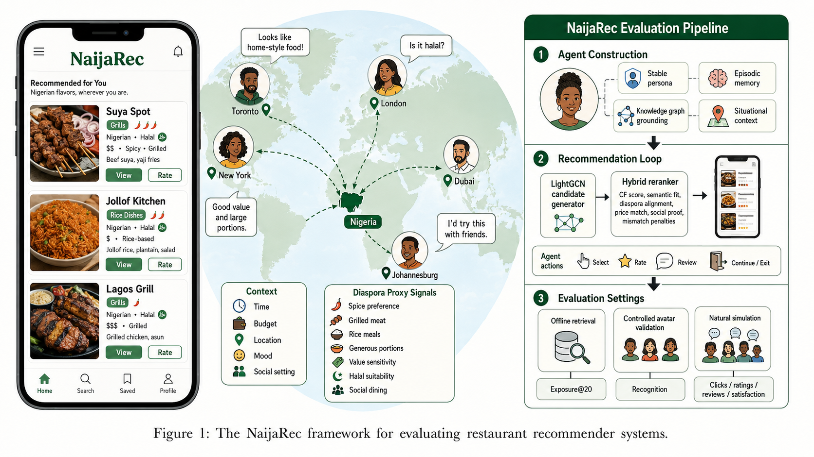
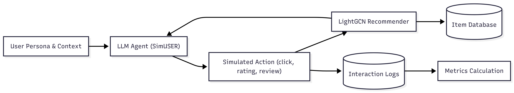

# NaijaRec Cold Start

NaijaRec evaluates text-driven cold-start recommendation in two domains:
Nigerian-contextualized Yelp restaurant recommendations and Amazon Grocery
cross-domain transfer. It uses keyword-based MPG retrieval and optional
Gemini-assisted hybrid reranking.

The offline experiments use review-derived preference text. The browser
application also accepts a new user's free-text persona.

This README is for running the code. Detailed methodology and discussion are in
[`docs/chapter_3_4_readme.md`](docs/chapter_3_4_readme.md) and
[`docs/task_b_naijarec_cold_start.md`](docs/task_b_naijarec_cold_start.md).
For the browser application, see [`app/README.md`](app/README.md).

## Quickstart

This is the shortest path to the headline Yelp result without making a new
Gemini API call:

```bash
python -m venv .venv
source .venv/bin/activate
python -m pip install -r requirements.txt
python -m spacy download en_core_web_sm

mkdir -p data/reviews
python -m gdown --fuzzy "https://drive.google.com/file/d/1xtAOenABW6i6RkR0AFFr7UTl8BCl6DNX/view?usp=sharing" \
  -O data/reviews/naija_yelp_paper.csv
python -m gdown --fuzzy "https://drive.google.com/file/d/1faToa2iVt7NvQz9rT-SzUL9KgXwvcKAS/view?usp=sharing" \
  -O data/reviews/naija_yelp_paper_splits.json

python extractor.py --city naija_yelp_paper --edgeType IUF --kwExtractor kw_NLTK --overwrite
python retrieval.py --city naija_yelp_paper --edgeType IUF --quantity 20 --validTopK 20 --export2LLMs
python taskB/hybrid_rerank.py --city naija_yelp_paper \
  --candidates data/out2LLMs/naija_yelp_paper_q20_knn2rest.json --alpha 0.3
```

Expected result: `NDCG@20 = 0.620736`. Continue with
[Amazon Cross-Domain Reproduction](#amazon-cross-domain-reproduction) to
reproduce the complete set of reported results.

## System Overview





> **Data required:** Complete result reproduction uses the prepared Yelp and
> Amazon review CSVs plus their small split files. Item metadata is needed for
> the app or live metadata-aware reranking. The large keyword, embedding,
> scoring, and candidate folders are generated outputs and do not need to be
> uploaded.

## What the Code Does

The offline pipeline has three stages:

1. Prepare review data and split users into training and evaluation groups.
2. Extract keywords from reviews and use MPG retrieval to find likely items.
3. Optionally rerank the retrieved items with stored or live Gemini output.

In plain terms:

| Term                  | Meaning in this project                                                                                    |
| --------------------- | ---------------------------------------------------------------------------------------------------------- |
| Cold start            | Recommend for evaluation users who were not part of the training user graph.                               |
| MPG                   | The keyword-graph retrieval step: `user -> keyword -> restaurant/product`.                                 |
| Hybrid reranking      | Combine MPG ordering with Gemini ordering.                                                                 |
| `naija_yelp_paper`    | The main Yelp cold-start dataset used for reported results. The restaurants are in US cities, not Nigeria. |
| `amazonGrocery`       | The full-catalog cross-domain Grocery experiment.                                                          |
| `amazonGrocery_dense` | The controlled true 3-core Grocery experiment.                                                             |

## Project Structure

| Path                              | Purpose                                                                      |
| --------------------------------- | ---------------------------------------------------------------------------- |
| `extractor.py`                    | Extract keywords and create sentence embeddings.                             |
| `retrieval.py`                    | Run MPG candidate retrieval and evaluation.                                  |
| `taskB/prepare_naija_yelp.py`     | Create prepared Yelp protocol files from original exports.                   |
| `taskB/prepare_amazon_reviews.py` | Create prepared Amazon protocol files when source inputs are available.      |
| `taskB/hybrid_rerank.py`          | Evaluate stored MPG + Gemini hybrid rankings.                                |
| `reRanker/rerank.py`              | Make optional live Gemini reranking calls.                                   |
| `app/`                            | Browser/API demo and packaged evaluated rankings.                            |
| `docs/`                           | Detailed methodology and result discussion.                                  |
| `data/`                           | Local prepared inputs and generated experiment artifacts; excluded from Git. |

## Choose a Route

| Goal                                               | Start with                                                            |
| -------------------------------------------------- | --------------------------------------------------------------------- |
| Reproduce the main Yelp result, without an API key | [Main Yelp reproduction](#main-yelp-reproduction-no-api-key)          |
| Reproduce the Amazon cross-domain results          | [Amazon cross-domain reproduction](#amazon-cross-domain-reproduction) |
| Build the prepared Yelp file from original exports | [Optional raw-data rebuild](#optional-raw-data-rebuild)               |
| Use the web interface                              | [`app/README.md`](app/README.md)                                      |

Start with Yelp to check the pipeline, then run Amazon to reproduce the
cross-domain evidence reported by this project. Both routes can be completed
without making a new Gemini API call.

## Setup

Use Python 3.10 or 3.11 on Linux, macOS, or WSL.

```bash
git clone <YOUR_REPOSITORY_URL>
cd <REPOSITORY_FOLDER>

python -m venv .venv
source .venv/bin/activate
python -m pip install --upgrade pip
pip install -r requirements.txt
python -m spacy download en_core_web_sm
```

Why the spaCy download is needed: `extractor.py` imports the spaCy English
model even when the commands below choose NLTK keyword extraction.

On the first keyword-extraction run, the code also downloads NLTK resources and
the `all-MiniLM-L6-v2` sentence-transformer model. This requires internet
access and can take a few minutes.

## Required And Generated Files

### Required For Offline Results

To reproduce all reported offline results, provide these prepared experiment
inputs. They are the model inputs, not generated cache folders.

| Required prepared input                        | Used for                                                                    | Download link                                                                              |
| ---------------------------------------------- | --------------------------------------------------------------------------- | ------------------------------------------------------------------------------------------ |
| `data/reviews/naija_yelp_paper.csv`            | Yelp retrieval and evaluation labels                                        | [Link](https://drive.google.com/file/d/1xtAOenABW6i6RkR0AFFr7UTl8BCl6DNX/view?usp=sharing) |
| `data/reviews/naija_yelp_paper_splits.json`    | Yelp train/test protocol                                                    | [Link](https://drive.google.com/file/d/1faToa2iVt7NvQz9rT-SzUL9KgXwvcKAS/view?usp=sharing) |
| `data/reviews/amazonGrocery.csv`               | Full Amazon Grocery retrieval and labels                                    | [Link](https://drive.google.com/file/d/1yOSVfAT4k139Y7LJjCHy4V64ljpE-G6e/view?usp=sharing) |
| `data/reviews/amazonGrocery_splits.json`       | Full Amazon train/test protocol                                             | [Link](https://drive.google.com/file/d/1v8Q1h3om902IzqLZrs-ySQQl4KR7PzWu/view?usp=sharing) |
| `data/reviews/amazonGrocery_dense.csv`         | Dense Amazon Grocery retrieval and labels; may instead be regenerated below | [Link](https://drive.google.com/file/d/14UYCplpWkw-lZIN8we4Hf4XpbtR2KVbn/view?usp=sharing) |
| `data/reviews/amazonGrocery_dense_splits.json` | Dense Amazon train/test protocol; generated with the dense CSV              | [Link](https://drive.google.com/file/d/1VgtiOVMK7DVX-tmqeMVYsYFoReyO-jZs/view?usp=sharing) |

The split JSON files are small protocol files. They are supplied above as
downloads, although committing them in a future release would simplify setup.

### Required For The App Or Live Reranking

MPG retrieval and stored-result evaluation do not read metadata. The
application and optional live metadata-aware reranking use these files:

| Metadata input                                            | Needed for                                                 | Download link                                                                              |
| --------------------------------------------------------- | ---------------------------------------------------------- | ------------------------------------------------------------------------------------------ |
| `data/metadata/naija_yelp_paper_restaurant_detail.csv`    | Restaurant app mode or live Yelp reranking                 | [Link](https://drive.google.com/file/d/1mUl4CZ3LHO4Ir_HsGUsWkWMKFVYhi5Qu/view?usp=sharing) |
| `data/metadata/amazonGrocery_restaurant_detail.csv`       | Full Grocery app mode or regeneration of the dense dataset | [Link](https://drive.google.com/file/d/1EnYYHPr8CQkLstrtyGsPi_VZN8rr1RGU/view?usp=sharing) |
| `data/metadata/amazonGrocery_dense_restaurant_detail.csv` | Dense Grocery app mode or live dense reranking             | [Link](https://drive.google.com/file/d/1LYOndpLsIi12xONiG-FJY7s1vfFGcztc/view?usp=sharing) |

### Generated Outputs

Do not upload these as required inputs. They are recreated by
`extractor.py` and `retrieval.py`.

| Generated path    | Contents                                      |
| ----------------- | --------------------------------------------- |
| `data/keywords/`  | Extracted train/test keyword files.           |
| `data/score/`     | Weighted item-keyword scores.                 |
| `data/embedding/` | Sentence-transformer keyword embeddings.      |
| `data/out2LLMs/`  | Retrieved candidate lists used for reranking. |

### Legacy Naming

This codebase inherits restaurant-oriented field names from its KALM4Rec
foundation. `rest_id` means **item ID**, and files named
`*_restaurant_detail.csv` mean **item metadata**. For Amazon Grocery those
names refer to products, not restaurants; the names are retained for
compatibility with the retrieval and application code.

### Download Prepared Inputs

Restore the prepared offline inputs into the paths used by the code:

```bash
mkdir -p data/reviews

python -m gdown --fuzzy "https://drive.google.com/file/d/1xtAOenABW6i6RkR0AFFr7UTl8BCl6DNX/view?usp=sharing" \
  -O data/reviews/naija_yelp_paper.csv
python -m gdown --fuzzy "https://drive.google.com/file/d/1faToa2iVt7NvQz9rT-SzUL9KgXwvcKAS/view?usp=sharing" \
  -O data/reviews/naija_yelp_paper_splits.json

python -m gdown --fuzzy "https://drive.google.com/file/d/1yOSVfAT4k139Y7LJjCHy4V64ljpE-G6e/view?usp=sharing" \
  -O data/reviews/amazonGrocery.csv
python -m gdown --fuzzy "https://drive.google.com/file/d/1v8Q1h3om902IzqLZrs-ySQQl4KR7PzWu/view?usp=sharing" \
  -O data/reviews/amazonGrocery_splits.json

python -m gdown --fuzzy "https://drive.google.com/file/d/14UYCplpWkw-lZIN8we4Hf4XpbtR2KVbn/view?usp=sharing" \
  -O data/reviews/amazonGrocery_dense.csv
python -m gdown --fuzzy "https://drive.google.com/file/d/1VgtiOVMK7DVX-tmqeMVYsYFoReyO-jZs/view?usp=sharing" \
  -O data/reviews/amazonGrocery_dense_splits.json
```

The last two downloads are not needed if regenerating the dense dataset.
Alternatively, restore full Amazon metadata and use the generation command in
[Dense Amazon Grocery True 3-Core Test](#2-dense-amazon-grocery-true-3-core-test).
Confirm that all prepared experiment inputs are available:

```bash
ls data/reviews/naija_yelp_paper.csv \
   data/reviews/naija_yelp_paper_splits.json \
   data/reviews/amazonGrocery.csv \
   data/reviews/amazonGrocery_splits.json \
   data/reviews/amazonGrocery_dense.csv \
   data/reviews/amazonGrocery_dense_splits.json
```

Stored rankings used for no-API hybrid evaluation are already included in the
repository:

```text
reRanker/results_rerank/naija_yelp_paper/zeroshot_3_5_12.json
reRanker/results_rerank/amazonGrocery_dense/zeroshot_scored_3_5_pool50_top20_hybrid_alpha_0.6_preserve_12.json
```

## Main Yelp Reproduction: No API Key

This route creates keyword files, embeddings, and MPG candidates from the
prepared Yelp dataset, then evaluates the stored hybrid reranking without
calling Gemini.

### 1. Extract Keywords and Embeddings

```bash
python extractor.py \
  --city naija_yelp_paper \
  --edgeType IUF \
  --kwExtractor kw_NLTK \
  --overwrite
```

This creates files in:

```text
data/keywords/
data/score/
data/embedding/
```

### 2. Retrieve Candidate Restaurants

```bash
python retrieval.py \
  --city naija_yelp_paper \
  --edgeType IUF \
  --quantity 20 \
  --validTopK 20 \
  --export2LLMs
```

This writes candidate rankings to `data/out2LLMs/` and appends the MPG metrics
to `log`. Display the latest logged metrics with:

```bash
tail -n 5 log
```

The expected MPG `NDCG@20` is `0.611271`.

### 3. Evaluate Stored Hybrid Reranking

```bash
python taskB/hybrid_rerank.py \
  --city naija_yelp_paper \
  --candidates data/out2LLMs/naija_yelp_paper_q20_knn2rest.json \
  --alpha 0.3
```

This final step reuses the saved Gemini ranking supplied in the repository. No
API key is needed.

To reproduce the second recorded hybrid blend, run:

```bash
python taskB/hybrid_rerank.py \
  --city naija_yelp_paper \
  --candidates data/out2LLMs/naija_yelp_paper_q20_knn2rest.json \
  --alpha 0.6
```

Expected headline Yelp results:

| Method                    |      NDCG@10 |      NDCG@20 | HitRate@20 |
| ------------------------- | -----------: | -----------: | ---------: |
| MPG retrieval             |     0.619777 |     0.611271 |   0.913721 |
| MPG + hybrid, `alpha=0.3` | **0.629689** | **0.620736** |   0.913721 |
| MPG + hybrid, `alpha=0.6` |     0.628581 |     0.620657 |   0.913721 |

### Optional: Random and Popularity Baselines

```bash
python taskB/evaluate_baselines.py \
  --history data/reviews/naija_yelp_paper.csv \
  --holdout data/reviews/naija_yelp_paper.csv \
  --k 20 \
  --splits data/reviews/naija_yelp_paper_splits.json \
  --dataset_name naija_yelp_paper \
  --split test \
  --history_split train
```

Expected `NDCG@20`: Random `0.005746`, Popularity `0.100273`.

## Amazon Cross-Domain Reproduction

Amazon Grocery is a core result of this project, not an input to the Yelp
model. It uses the same keyword extraction and MPG retrieval pipeline on a
different item domain. Begin from the prepared CSVs listed in
[Required And Generated Files](#required-and-generated-files); no
`data/raw/` file is required.

### 1. Full Amazon Grocery Stress Test

```bash
python extractor.py \
  --city amazonGrocery \
  --edgeType IUF \
  --kwExtractor kw_NLTK \
  --overwrite

python retrieval.py \
  --city amazonGrocery \
  --edgeType IUF \
  --quantity 20 \
  --validTopK 20 \
  --export2LLMs
```

Expected full-catalog MPG result using metadata-enriched `full_text`:

| Precision@20 | Recall@20 |    F1@20 |  NDCG@20 |
| -----------: | --------: | -------: | -------: |
|     0.035729 |  0.099116 | 0.050132 | 0.320753 |

### 2. Dense Amazon Grocery True 3-Core Test

If `amazonGrocery_dense.csv` was not distributed separately, generate it from
the prepared full Grocery dataset and its metadata:

```bash
mkdir -p data/metadata
python -m gdown --fuzzy "https://drive.google.com/file/d/1EnYYHPr8CQkLstrtyGsPi_VZN8rr1RGU/view?usp=sharing" \
  -O data/metadata/amazonGrocery_restaurant_detail.csv

python taskB/prepare_amazon_reviews.py \
  --reviews data/reviews/amazonGrocery.csv \
  --metadata data/metadata/amazonGrocery_restaurant_detail.csv \
  --dataset_name amazonGrocery_dense \
  --min_reviews 5 \
  --min_item_reviews 3 \
  --max_items 10000
```

Then run dense retrieval:

```bash
python extractor.py \
  --city amazonGrocery_dense \
  --edgeType IUF \
  --kwExtractor kw_NLTK \
  --overwrite

python retrieval.py \
  --city amazonGrocery_dense \
  --edgeType IUF \
  --quantity 20 \
  --validTopK 20 \
  --export2LLMs
```

Prepared dense dataset summary:

| Users | Reviews | Items | Train / dev / test users |
| ----: | ------: | ----: | -----------------------: |
| 2,074 |  17,187 | 3,532 |        1,659 / 207 / 208 |

Expected dense MPG result:

| Precision@20 | Recall@20 |    F1@20 |  NDCG@20 |
| -----------: | --------: | -------: | -------: |
|     0.066827 |  0.174981 | 0.089956 | 0.445954 |

### 3. Evaluate the Stored Dense Hybrid Ranking

The dense Gemini hybrid output is already stored in Git. This command passes
that stored final ordering through the evaluator; `--alpha 0` means use the
provided stored ordering unchanged rather than making a new Gemini request.

```bash
python taskB/hybrid_rerank.py \
  --city amazonGrocery_dense \
  --candidates data/out2LLMs/amazonGrocery_dense_q20_knn2rest.json \
  --llm_rank reRanker/results_rerank/amazonGrocery_dense/zeroshot_scored_3_5_pool50_top20_hybrid_alpha_0.6_preserve_12.json \
  --groundtruth data/reviews/amazonGrocery_dense.csv \
  --alpha 0 \
  --output /tmp/amazonGrocery_dense_stored_eval.json
```

Expected stored dense hybrid result:

| Precision@20 | Recall@20 |    F1@20 |      NDCG@20 |
| -----------: | --------: | -------: | -----------: |
|     0.066827 |  0.174981 | 0.089956 | **0.488582** |

## Optional Raw-Data Rebuild

This is not required when distributing `naija_yelp_paper.csv`. Use it only to
regenerate the prepared CSV and enriched metadata from the original notebook
exports. It requires `user_review_history.json` and the original
`restaurant_detail.csv`:

```bash
python taskB/prepare_naija_yelp.py \
  --user_history user_review_history.json \
  --restaurant_detail restaurant_detail.csv \
  --dataset_name naija_yelp \
  --target_cities Philadelphia Tampa Nashville \
  --holdout_per_user 1 \
  --cold_start \
  --paper_protocol_dataset naija_yelp_paper
```

Expected main dataset summary:

| Item                     |             Count |
| ------------------------ | ----------------: |
| Users                    |             9,614 |
| Reviews                  |           101,708 |
| Restaurants              |             2,608 |
| Train / dev / test users | 7,691 / 961 / 962 |

The command produces the prepared Yelp files in `data/reviews/` and
`data/metadata/`. Continue with
[Main Yelp reproduction](#main-yelp-reproduction-no-api-key).

## Optional Live Gemini Reranking

Only this stage requires a Gemini API key. Live output can differ from the
stored result because hosted models and API conditions may change.

```bash
export GOOGLE_API_KEY="YOUR_GEMINI_API_KEY"

python reRanker/rerank.py \
  --city naija_yelp_paper \
  --api_key "$GOOGLE_API_KEY" \
  --groundtruth_file data/reviews/naija_yelp_paper.csv \
  --metadata_file data/metadata/naija_yelp_paper_restaurant_detail.csv \
  --test_candidate_file data/out2LLMs/naija_yelp_paper_q20_knn2rest.json \
  --train_candidate_file data/out2LLMs/naija_yelp_paper_q20_user2candidate.json \
  --rerank_mode listwise \
  --candidate_pool_k 20 \
  --rerank_top_k 20 \
  --request_delay 4.5 \
  --max_users 962
```

Keep API keys in environment variables only. Do not commit `.env` files or
logs that contain keys.

## Result Summary

| Evaluated setting                | Best documented method           |      NDCG@20 |
| -------------------------------- | -------------------------------- | -----------: |
| Yelp restaurant cold-start       | MPG + Gemini hybrid, `alpha=0.3` | **0.620736** |
| Full Amazon Grocery cross-domain | MPG with enriched `full_text`    | **0.320753** |
| Dense Amazon Grocery true 3-core | MPG + Gemini hybrid, `alpha=0.6` | **0.488582** |

Yelp and Amazon use different catalogs and should not be compared as if one
were an accuracy replacement for the other. Amazon demonstrates cross-domain
transfer of the pipeline.

## Common Problems

| Problem                                                | Fix                                                                                              |
| ------------------------------------------------------ | ------------------------------------------------------------------------------------------------ |
| `FileNotFoundError` for `naija_yelp_paper.csv`         | Download the prepared Yelp CSV into `data/reviews/`.                                             |
| `FileNotFoundError` for `naija_yelp_paper_splits.json` | Include the small split protocol file in `data/reviews/`; extraction cannot run without it.      |
| `FileNotFoundError` for `amazonGrocery*.csv`           | Restore both prepared Amazon CSVs and their split files to reproduce cross-domain results.       |
| Error loading `en_core_web_sm`                         | Run `python -m spacy download en_core_web_sm` inside the activated virtual environment.          |
| Extraction stalls on the first run                     | Allow time and internet access for NLTK and sentence-transformer downloads.                      |
| Gemini authentication or quota failure                 | Use the stored hybrid route, which needs no API key.                                             |
| Live Gemini scores do not exactly match the table      | Use stored rankings for reproducible evaluation; live LLM calls are not deterministic over time. |

## Citation And License

This repository adapts the retrieval and reranking approach from the upstream
[KALM4Rec repository](https://github.com/hai-luu/KALM4Rec). When using this
code or its reported results, cite the NaijaRec project report and the
upstream work.

No `LICENSE` file or formal `CITATION.cff` is currently included in this
repository. Add the selected license and final citation metadata before public
redistribution. Downloaded Yelp and Amazon inputs remain subject to their
original providers' usage terms.

## Further Reading

- [`app/README.md`](app/README.md): run the browser/API application.
- [`docs/chapter_3_4_readme.md`](docs/chapter_3_4_readme.md): methodology and full experimental discussion.
- [`docs/task_b_naijarec_cold_start.md`](docs/task_b_naijarec_cold_start.md): task adaptation notes and additional protocols.
